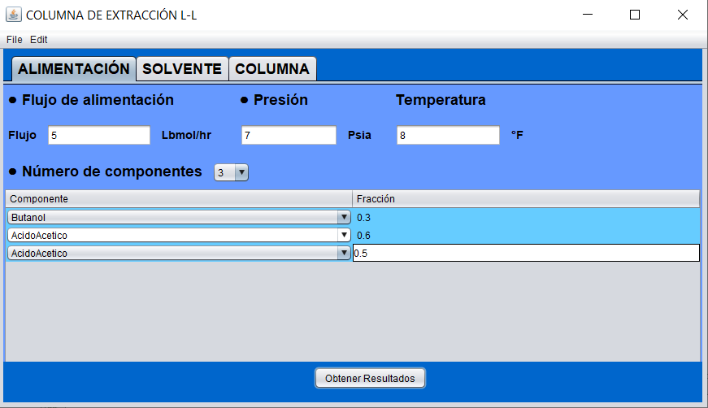
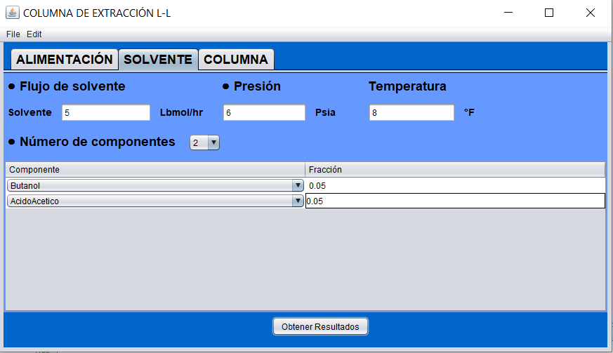
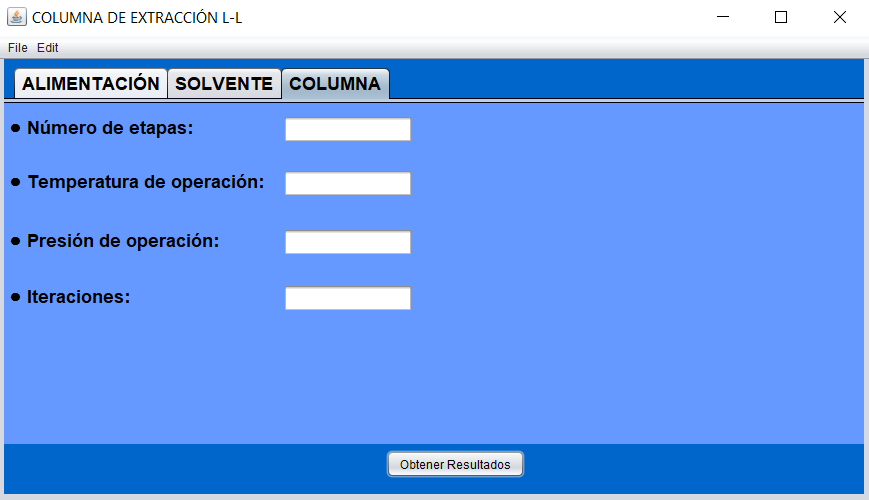

# L-L_Extraction_simulator
Liquid - liquid extraction simulator for a Chemestry project

## PROCESS OVERVIEW

While distillation takes advantage of different volatilities - different distributions of a product in the liquid and gas phases - liquid/liquid extraction is based on different solubilities - different distributions of a product in 2 coexisting liquid phases.

## SOLVENT REQUIREMENTS

The solvent should be tested for the following characteristics:

- Maximum solubility of the product in the solvent.
- Minimum solubility of the solvent in the refining
- Minimum solubility of the feed liquid in the solvent
- Rapid phase separation of the extract from the refining process
- Easy separation of the product from the extract/solvent
- With the right solvent it is possible to perform numerous applications conveniently by an extraction process as described below.

## WHEN TO USE THE EXTRACTION PROCESS

The liquid/liquid extraction process is suitable for separations of:

- products of similar volatilities
- products that form azeotropes
- products whose distillation requires high energy consumption temperature-sensitive
- products non-volatile products such as metallic salts

### Views

